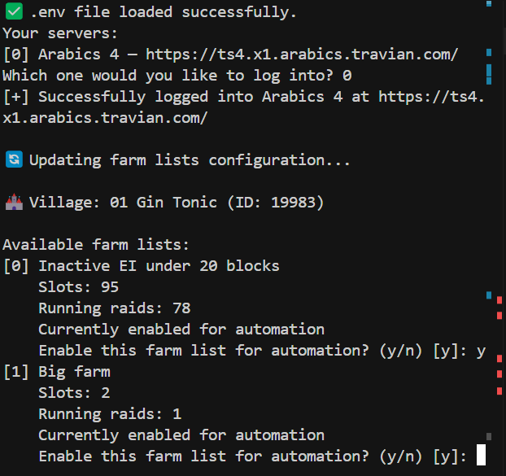
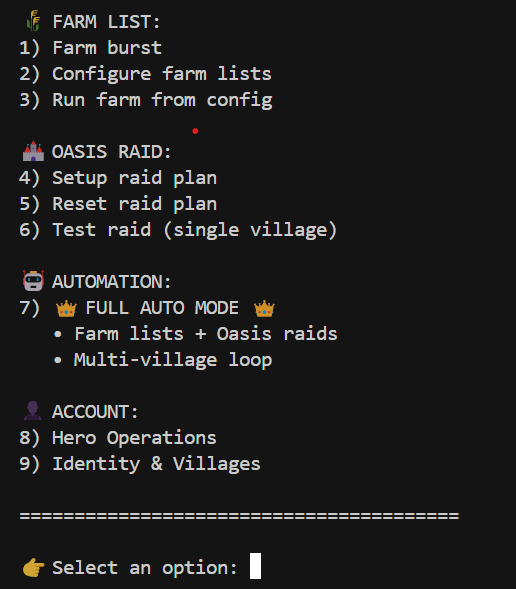
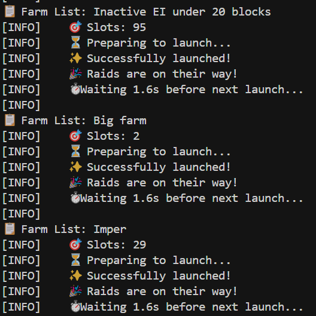
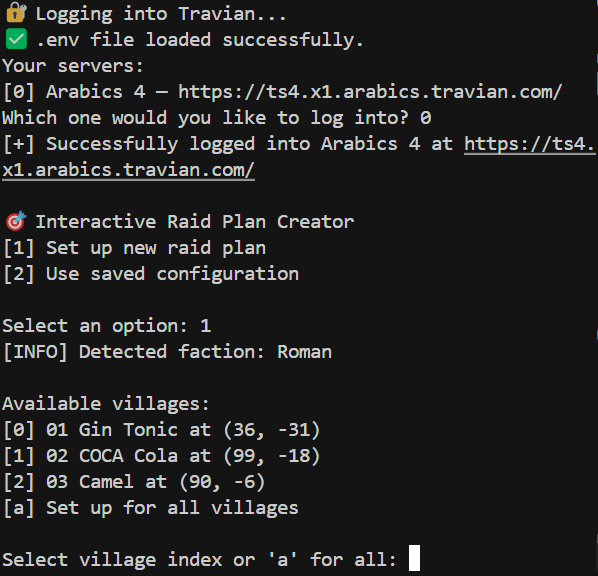
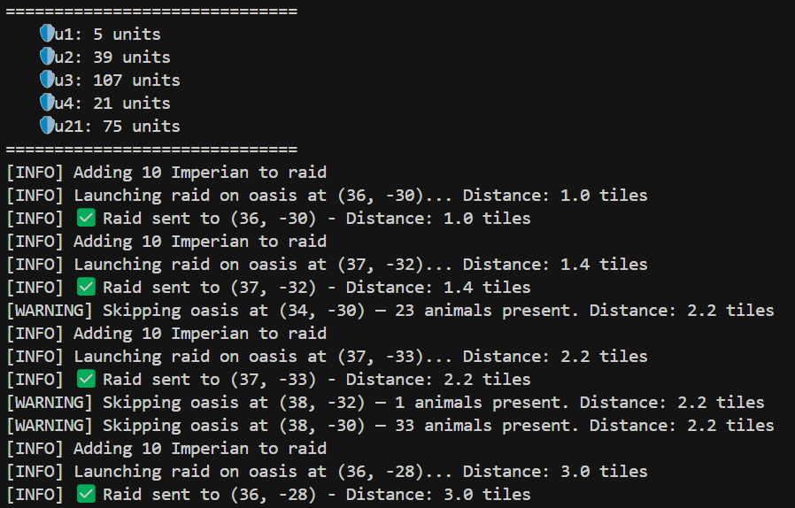
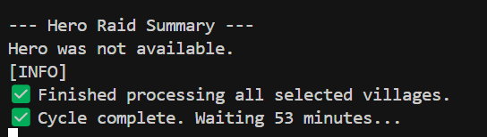

# Travian Legends Bot

🚀 **Level Up Your Travian Game!** 🏰
⚔️ **Dominate the Map with Advanced Automation** ⚔️



An automated bot for Travian Legends that handles farming and oasis raiding operations.

## Features

- **Farm List Automation**
  - Automated sending of farm lists with configurable delays
  - Random timing variations to avoid detection
  - Auto-recovery from session timeouts
  - Configurable stop time (default: 9 AM)
  - Multi-village support
  - Farm list configuration per village

- **Map Analysis & Scanning**
  - Full map scanning around any village
  - Configurable scan radius
  - Multiple analysis modules:
    - Unoccupied oasis detection
    - Oasis animal power calculation
    - Distance-based sorting
  - Extensible analysis system for future features
  - Scan data persistence for offline analysis
  - Multi-village scanning support

- **Oasis Raiding**
  - Smart oasis selection based on distance
  - Animal detection to avoid losses
  - Configurable maximum raid distance
  - Support for multiple unit types
  - Hero raiding capability
  - Automatic troop availability checking
  - Multi-village support
  - Continuous raiding with 50-minute intervals

## Setup

1. Clone the repository:
```bash
git clone https://github.com/yourusername/travian_legends_bots.git
cd travian_legends_bots
```

2. Create a virtual environment and install dependencies:
```bash
python -m venv venv
source venv/bin/activate  # On Windows: venv\Scripts\activate
pip install -r requirements.txt
```

3. Run the launcher:
```bash
cd API_based_automations/travian_bot
python launcher.py
```

The bot will guide you through the identity setup process, creating all necessary configuration files automatically.

## Usage

The bot provides several operation modes through an interactive launcher:

1. **One-time Farm + Raid** - Executes one round of farming and raiding
2. **Infinite Safe Loop** - Continuously farms and raids with safety checks
3. **Reset Raid Plan** - Clears the saved raid configuration
4. **Setup New Raid Plan** - Interactive setup for a new raiding strategy
5. **Update Identity** - Updates village and player information
6. **Hero Operations** - Manages hero-related activities
7. **Map Scanning** - Analyze the map around your villages
8. **Run Multi-village Raid Planner** - Full automation for all villages
9. **Run Farm List Raider** - Run farm lists from saved configuration
10. **Configure Farm Lists** - Setup farm list automation per village

### Getting Started with Full Automation

To set up full automation (Option 8), follow these steps in order:

1. **Update Identity** (Option 5)
   - This ensures your village information is up to date
   - Required for both farm lists and oasis raids

2. **Configure Farm Lists** (Option 10)
   - Set up which farm lists to run for each village
   - Enable/disable automation for each list

3. **Map Analysis** (Option 7)
   - Scan the map around each village
   - Analyze for unoccupied oases and other targets
   - Save data for raid planning

4. **Setup Raid Plans** (Option 4)
   - Configure raid settings for each village
   - Set maximum distances and unit combinations
   - Save the configuration

5. **Run Multi-village Raid Planner** (Option 8)
   - The bot will:
     - Run all enabled farm lists for each village
     - Execute oasis raids based on saved plans
     - Repeat every 50 minutes
     - Handle errors and session timeouts

## Configuration

- Farm list configurations are stored in `database/farm_lists/`
- Raid settings are stored in `database/raid_plans/`
- Village and player information is stored in `database/identity.json`
- Map scan data is stored in `database/full_map_scans/`
- Unoccupied oases data is stored in `database/unoccupied_oases/`

## Safety Features

- Distance-based raid targeting
- Animal presence detection
- Automatic session recovery
- Random timing variations
- Safe shutdown at specified time
- Error handling and retry mechanisms
- Multi-village coordination

## Documentation

### Visual Guides

#### Main Interface


*The main launcher interface showing all available options*

#### Farm List Management


*Configure which farm lists to run for each village*



*Launch farm lists with automatic timing and recovery*

#### Map Analysis & Scanning


*Map scanning and analysis features:*
- Scan any radius around your villages
- Multiple analysis modules (oases, distances, etc.)
- Save data for offline analysis
- Extensible for future features (crop fields, villages, etc.)



*Oasis analysis and targeting based on scan data*

#### Operation Status


*Successful completion of a raid cycle with automatic timing for next run*

## Contributing

Feel free to submit issues and pull requests.

## Disclaimer

This is an unofficial bot for Travian Legends. Use at your own risk. The authors are not responsible for any consequences of using this bot. This bot exists for an educational purpose (my own) to prove I understand Travian API and structures. That's all. 

## License

MIT License
